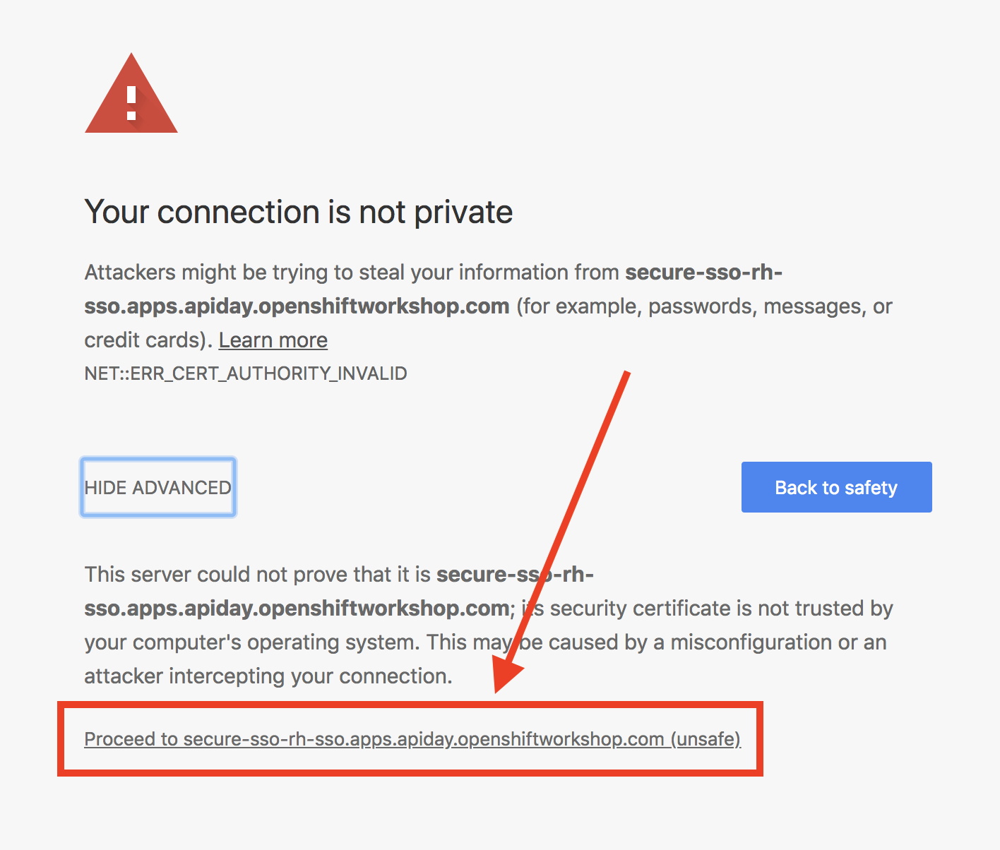
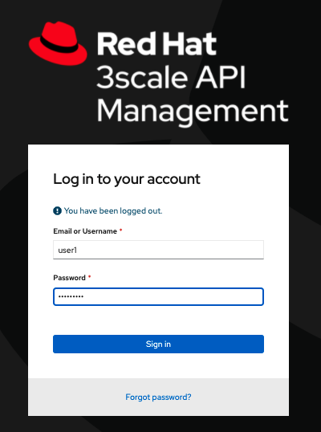
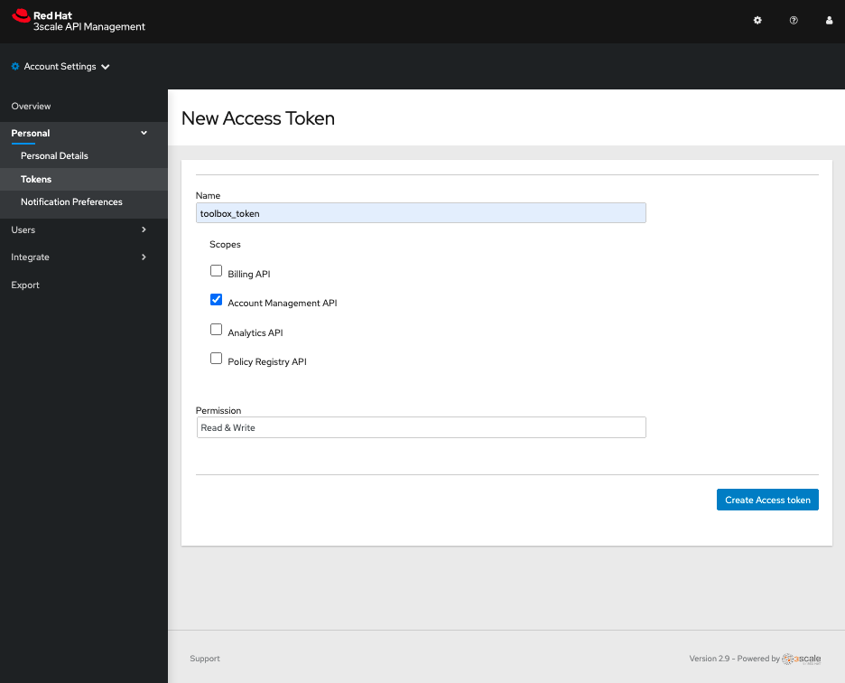

# Lab 202

## Jenkins CICD

### Connect 3scale toolbox locally and create the secret file

* Duration: 25 mins
* Audience: Developers, Architects, Devops

## Overview

This section covers how to connect to the 3Scale on premise running instance

### Environment

**URLs:**

Check with your instruction the *GUID* number of your current workshop environment. Replace the actual number on all the URLs where you find **GUID**. 

Example in case of *GUID* = **1234**: 

```bash
https://master.GUID.open.redhat.com
```

becomes =>

```bash
https://master.1234.open.redhat.com
```

**Credentials:**

Your username is your asigned user number. For example, if you are assigned user number **1**, your username is: 

```bash
user1
```

The password to login is always the same:

```bash
openshift
```

## Lab Instructions

### Step 1: Creating APIs with Apicurio Studio

1. Open a browser window and navigate to:

    ```bash
    https://userX-admin.apps.GUID.open.redhat.com/
    ```

2. Accept the self-signed certificate if you haven't: 

    1. If using Google Chrome click the **ADVANCED** link.

      

    2. Then click the **Proceed to..** link to accept the certificate and add the exception.

      

3. Log in using your designated [user and password](#environment).

    

4. Click on the **wheel** icon in the top right corner.

    

5. Click on **Personal Settings** and then **Tokens**.

    

6. In Access Tokens Section, click on **Add Access Token**

    

7. Create a brand new Access Token with the following information:

    * Name: **toolbox_token**
    * Scopes: **Account Management API**
    * Permission: **Read & Write**

    

8.  Click on **Create Access Token**.

9.   Finally, Ensure that you have copied the token generated with green color. We are going to use it later.

    

10.  Click on **I have copied the token**.

### Step 2: Connecting the 3scale toolbox

We have already setup the token for our user, now it's time to connect it with our 3scale-toolbox client, previosly installed.

Let's start adding our 3Scale on-prem instance.

1. Go to you terminal and type the following command:

    ```bash
    3scale remote add 3scale-onprem "https://TOKEN@USERX-admin.apps.GUID.open.redhat.com/" -k
    ```

    * -k option: Allows to make the request with self signed certificates
    * TOKEN: Add the Token generated previously.
    * USERX: Add you username, For example: user1
    * GUID: Add your instance name
  
2. Locate you configation file, type the command to locate the `.3scalerc.yml`:

   ```bash
    3scale --help
    ```

    * Under the options section you will find -c ot --config-file option with the location of the file:
    

### Step 3: Create the 3cale-toolbox secret
If we want to use 3scale-toolbox in our Jenkins pipelines, we need to create the recently created `.3scalerc.yaml` file in our project. The toolbox will use the credentials provided in the `yaml` to access our 3scale On Premise instance.

1. Run the following command using the OC client:
   ```bash
    oc create secret generic 3scale-toolbox -n userX --from-file="$HOME/.3scalerc.yaml"
   ```
   For example:

   ```bash
        oc create secret generic 3scale-toolbox -n user1 --from-file=/Users/mikelsanchezherrero/.3scalerc.yaml
   ```

## Steps Beyond

So, you want more? Have you tried to familiarize with 3scale-toolbox, try different commands.

## Summary

In this lab you have learned how to generate access tokens and how to get the `.3scalerc.yaml`.

You can now proceed to [Lab 3](../lab203/#lab-3)

## Notes and Further Reading

* 3Scale API Gateway
  * [Tokens](https://access.redhat.com/documentation/en-us/red_hat_3scale_api_management/2.4/html/accounts/tokens)