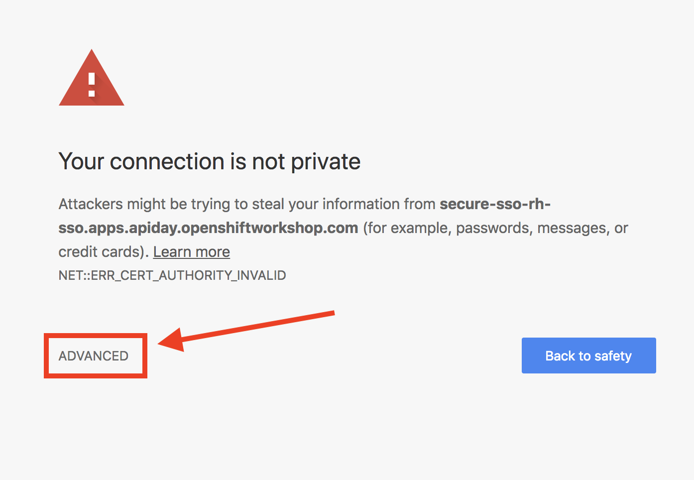
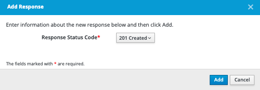

# Lab 203

## Jenkins CICD

### Create new OpenAPI specification file

* Duration: 30 mins
* Audience: Developers, Architects, Devops

## Overview

This sections reminds us, how to create an API definition based on OpenAPI 3.0.2, based on this specification file we are going to deploy a NodeJS app.

### Skipping The Lab

We know sometimes we don't have enough time to go over step by step on the labs.

If you are planning to skip this lab and follow the next one, we have already added the definition file in the here is a [link](https://raw.githubusercontent.com/misanche/3scaleworkshop-todo-app/main/src/openapi/openapi.yaml) to the specification generated in this lab.

### Environment

**URLs:**

Check with your instruction the *GUID* number of your current workshop environment. Replace the actual number on all the URLs where you find **GUID**.

Example in case of *GUID* = **1234**:

```bash
https://master.GUID.open.redhat.com
```

becomes =>

```bash
https://master.1234.open.redhat.com
```

**Credentials:**

Your username is your asigned user number and @openshiftworkshop.com. For example, if you are assigned user number **1**, your username is:

```bash
user1@openshiftworkshop.com
```

The password to login is always the same:

```bash
openshift
```

## Lab Instructions

### Step 1: Creating APIs with Apicurio Studio

1. Open a browser window and navigate to:

    ```bash
    http://apicurio-studio.apps.GUID.open.redhat.com/
    ```

2. Accept the self-signed certificate if you haven't: 

    1. If using Google Chrome click the **ADVANCED** link.

      

    2. Then click the **Proceed to..** link to accept the certificate and add the exception.

      

3. Log in using your designated [user and password](#environment).

    

4. Click on **APIs** in the left side navigation menu from the Dashboard page.

    

5. Click on **Create New API**.

    

6. Create a brand new Access Token with the following information:

    * Name: **Todo List**
    * Description: **Todo List Spec **
    * Type: **OpenAPI 3.0.2**
    * Template: **Blank API**

    

7.  On the next screen, Click on **Edit API**.

    

8.  Now, we are going to create a new Data Type, click on **Add a data type**.

    

9.   Fill the sections with the following data:

     * Name: **Item**
     * Description: **Item type**
     * Enter JSON example:

        ```json
            {
                "id": "3423432432",
                "name": "Bananas",
                "description": "Buy bananas at Carrefour"
            }
        ```

     * Choose to create a REST Resource with the Data Type: **No Resource**
    

10. Click **Save** button.
11. Click on **Add a path** button:
   
12. Enter a valid path:
   * Path: **/items**
   
13. Click **Add** button.
14. Under the operations sections, click on **GET** button and click **Add Operation** button, then fill the **Operation ID** with **getItems**.
   
   
15. The next step is add a new response for this GET operation, to do that, just click **Add a response** button.
   
16. In the popup select **200 OK** Response Status Code and click **Add** button.
    
17. To remove all the warnings appeared in the 200 Status code Response, we need to fill the Description field, click **edit** button:
    Description: **valid response**
18. Click **Add a media type ** button in the same section.
    
19. Select **application/json** option and click **Add** button:
    
20. Follow the steps as they appear in the image:
     * Type: **Array**
     * of: **Item**
21. Lastly, Add an example:
    * Name: **items**
    * Example:
        ```json
                [
            {
                "id": "123123",
                "name": "Buy Bananas",
                "description": "Buy Bananas"
            },
            {
                "id": "345345",
                "name": "Buy Chocolate",
                "description": "85% chocolate"
            }
        ]
        ```
### Step 2: Create POST method

We have already setup the GET `/items` endpoint, let's increase it and add a second endpoint using th POST method. This method will allow us to create new Items.

1.  Under the operations sections, click on **POST** button click **Add Operation** button then fill the **Operation ID** with **createItem** then .
2.  
   

   

2. With POST Operations, we need to send a body with the Item we want to create, to do that, click on **Add a request body**

   

3. Now click on **Add a media type** button, choose on **Type** the **application/json**

   

4. fill the form following the steps:

   * Required
   * Type: **Item**

   

5. Click on example and then **Add an example** button.

   

6. Fill the popup with the data:

   * Name: **item**
   * Example:

   ```json
        {
            "id": "123123",
            "name": "Buy Bananas",
            "description": "Buy Bananas"
        }
    ```

    

7. The next step is add a new response for this POST operation, to do that, just click **Add a response** button.

   

8. In the popup select **201 OK** Response Status Code and click **Add** button.

    

17. To remove all the warnings appeared in the 200 Status code Response, we need to fill the Description field
    * Description: **Created description**

### Step 4: Secure the api
1. In order to secure the api with 3scale API Gateway, we are going to define a new security scheme, based on api-key, click **Add a security scheme** button under security schemes section:

2. Fill the form with the following data:
    * Name: **api-key**
    * Description: **Use a 3scale API Key**
    * Type: **API Key**
    * Key Location: **HTTP header**
    * Name: **api-key**


### Step 3: Save the Definition file

1. Finally, we have created the both endpoints needed for our application, to save the definition file, click **Todo List** breadcrumb.
    
2. Click **3 dots** and then **Download** button
    
3. Select the options as they appear, `yaml` format and without references:
    


## Steps Beyond

So, you want more? Have you tried to familiarize with 3scale-toolbox, try different commands.

## Summary

In this lab you have learned how to generate access tokens and how to get the `.3scalerc.yml`.

You can now proceed to [Lab 3](../lab203/#lab-3)

## Notes and Further Reading

* 3Scale API Gateway
  * [Tokens](https://access.redhat.com/documentation/en-us/red_hat_3scale_api_management/2.4/html/accounts/tokens)