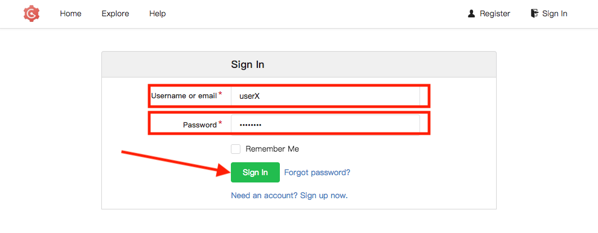
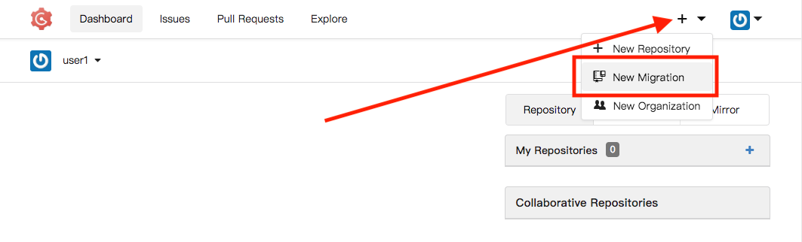
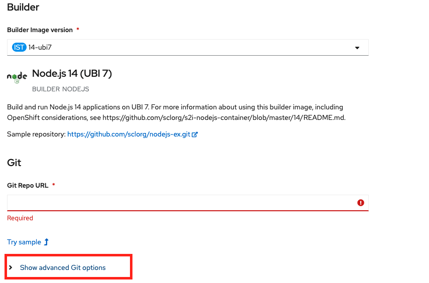

# Lab 204

## Jenkins CICD

### Deploy NodeJS TODO App

* Duration: 30 mins
* Audience: Developers, Architects, Devops

## Overview

This section covers how to run NodeJS Todo app in Openshift.

### Environment

**URLs:**

Check with your instruction the *GUID* number of your current workshop environment. Replace the actual number on all the URLs where you find **GUID**. 

Example in case of *GUID* = **1234**: 

```bash
https://master.GUID.open.redhat.com
```

becomes =>

```bash
https://master.1234.open.redhat.com
```

**Credentials:**

Your username is your asigned user number. For example, if you are assigned user number **1**, your username is: 

```bash
user1
```

The password to login is always the same:

```bash
openshift
```

## Lab Instructions

### Step 0: Setup the collaboration environment using Git (Gogs)

For this lab we require a collaboration environment based on Git. You can use GitHub, GitLab or other Git provider to finish this lab. If you don't want to use your personal account, the provided lab environment has an user provided for you in Gogs.

Follow this instructions to set up the repository.

1. Open a browser window and navigate to:

    ```bash
    http://gogs.apps.GUID.open.redhat.com/user/login?redirect_to=
    ```

1. Log into Gogs using your designated [user and password](#environment). Click on **Sign In**.

    

1. In the main page, click in the **+** sign in the right top corner to display the *New* menu. Click the **New Migration** option.

    

1. Fill in the information of the repository migration with the following values:

    * Clone Address: **https://github.com/misanche/3scaleworkshop-todo-app.git**
    * Owner: **UserX**
    * Repository Name: **todo-app**

    

2. Click on **Migrate Repository** to fork the GitHub repo into Gogs.

    *You now have a working copy of the todo app backend. If you know how to, clone the repository to work locally, or you can continue working using Gogs online editor*.

### Step 1: Deploying Todo app

Todo App creates a Node.js backend. This allow us to make calls and retrieve information about what we need to do.

1. Open a browser window and navigate to:

    ```bash
    https://master.GUID.open.redhat.com/console
    ```

    *Remember to replace the GUID with your [environment](#environment) value and your user number.*

2. Accept the self-signed certificate if you haven't.

    

3. Log into OpenShift using your designated [user and password](#environment). Click on **Sign In**.

    

4. You are now in OpenShift's main page. Click on your **userX** project in the right side of the screen.

    

5. From your main project page, click **Browse Catalog**.

    

6. Scroll down the page and search for the **Node.js** template. Click on the link.

    

7. Click the **Next >** button.

    
8. Click the **advanced options** link, the reason is because we are using the new github branching model, where `master` is no longer de default branch, instead `main` is used.
    
9.  Fill the data with:
    * Name: **todo-app**
    * Git Repository URL: **http://gogs.apps.GUID.open.redhat.com/userX/todo-app.git**
    * Git Reference: **main**
    
10. Click **Create** blue button located at the bottom of the page.
11. In the Overview section you will be able to see how the new build is running, later todo-app deployment will appear as deployed:
     
12. Now you can type the following in your terminal to retrieve the response from the service
    ```bash
    curl --location --request GET 'http://todo-app-userX.apps.GUID.open.redhat.com/items'
    ```
    or you can add new values:

    ```bash
    
    curl --location --request POST 'http://todo-app-userX.apps.GUID.open.redhat.com/items' \
    --header 'Content-Type: application/json' \
    --data-raw '{
        "id": "2323",
        "name": "test",
        "description": "test desc"
    }'
    ```

## Steps Beyond

So, you want more? Did you notice the link **source** when editing the *Paths* or the *Definitions*? Get back to the API editor and follow the link. What do you see? Apicurio lets you follow the form-based editor or go one step beyond and also lets you direct edit the source of your API definition.

## Summary

In this lab you used Apicurio Studio to create a simple API definition using the OpenAPI Specification. You learned how to author and download a standards compliant API Specification using Red Hat's APICurio.

You can now proceed to [Lab 2](../lab02/#lab-2)

## Notes and Further Reading

* Apicurio
  * [Webpage](https://www.apicur.io)
  * [Roadmap](https://www.apicur.io/roadmap/)
* OpenAPI
  * [OpenAPI Initiative](https://www.openapis.org/)
  * [OpenAPI Specification 3.0.1](https://github.com/OAI/OpenAPI-Specification/blob/master/versions/3.0.1.md)


oc new-build http://gogs.apps.bilbao-8ecb.open.redhat.com/user1/todo-app.git#main --name=todo-app-pipeline -n user1

oc set env bc/todo-app-pipeline GIT_REPO="http://gogs.apps.bilbao-8ecb.open.redhat.com/user1/todo-app.git" \
GIT_BRANCH="main" PARAMS_OPENAPI_SPEC="src/openapi/openapi.yaml" \
APP_NAME="todo_api" \
PRIVATE_URL="http://todo-app-user1.apps.bilbao-8ecb.open.redhat.com" \
STAGING_URL="https://todo-user1.pre.apps.bilbao-8ecb.open.redhat.com:443" \
PRODUCTION_URL="https://todo-user1.pro.apps.bilbao-8ecb.open.redhat.com:443" \
INSTANCE="3scale-onprem" OCP_PROJECT="user1" \
SECRET_NAME="3scale-toolbox" TEST_ENDPOINT="/items" -n user1