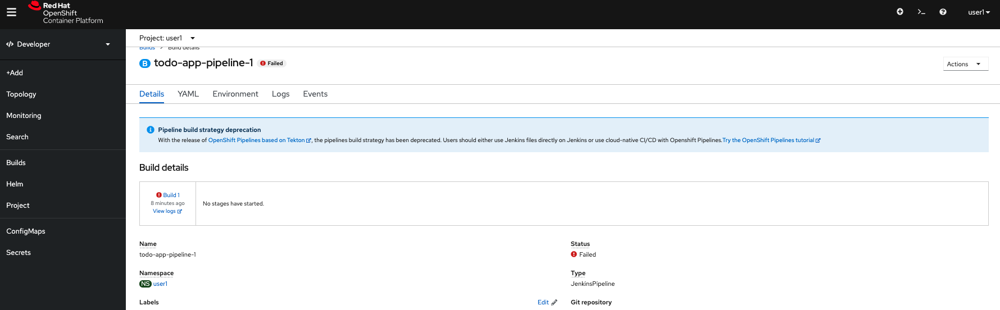
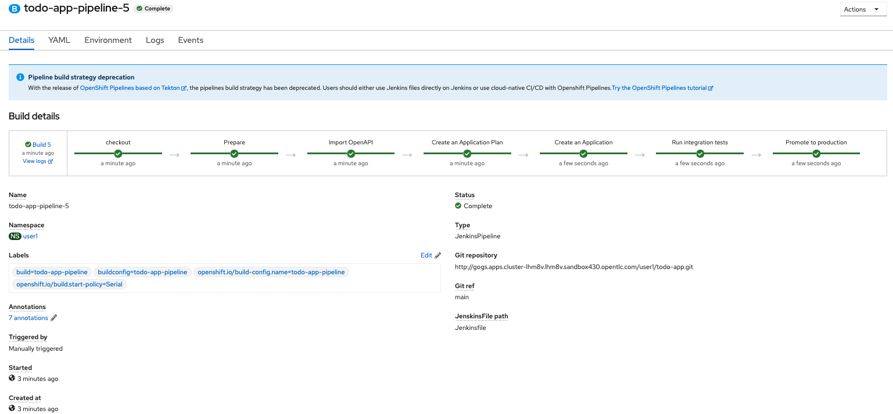

# Lab 205

## Jenkins CICD

### Create Jenkins pipeline build

* Duration: 15 mins
* Audience: Developers, Architects, Devops

## Overview

This section covers how to create an openshift pipeline build to trigger a jenkins slave and deploy our API in Openshift.

### Environment

**URLs:**

Check with your instruction the *GUID* number of your current workshop environment. Replace the actual number on all the URLs where you find **GUID**.

Example in case of *GUID* = **cluster-lhm8v.lhm8v.sandbox430**:

```bash
https://console-openshift-console.apps.GUID.opentlc.com
```

becomes =>

```bash
https://console-openshift-console.apps.cluster-lhm8v.lhm8v.sandbox430.opentlc.com
```

**Credentials:**

Your username is your asigned user number. For example, if you are assigned user number **1**, your username is: 

```bash
user1
```

The password to login is always the same:

```bash
openshift
```

## Lab Instructions

### Step 0: Login your OC Cli

One of the prerequisites of this course is having an OC Cli already installed. if you don't have please go to [Install Openshift CLI](https://docs.openshift.com/container-platform/3.11/cli_reference/get_started_cli.html).

1. Once you have the Openshift Cli, you need to login, Open a new temrinal and type the following:

1. Open a browser window and navigate to:

    ```bash
    oc login https://api.GUID.opentlc.com:6443 -p $PASSWORD -u $USER
    ```

    *Remember to replace the GUID with your [environment](#environment) value and your user number.*

2. Once you have been loged in, you need to create a new build Jenkins pipeline Build.

    ```bash
    oc new-build http://gogs.apps.GUID.opentlc.com/userX/todo-app.git#main --name=todo-app-pipeline -n user1
    ```

3. The first time it will fail, this is because we haven't set the variables needed for the pipeline to run.
   
4. If you want to see how it fails, please go to **Builds** and **Pipelines** section.
   

   

5. To set the variables type the following command:

   ```bash
    oc set env bc/todo-app-pipeline GIT_REPO="http://gogs.apps.GUID.opentlc.com/userX/todo-app.git" \
    GIT_BRANCH="main" PARAMS_OPENAPI_SPEC="src/openapi/openapi.yaml" \
    APP_NAME="todo_api" \
    PRIVATE_URL="http://todo-app-userX.apps.GUID.opentlc.com" \
    STAGING_URL="https://todo-userX.pre.apps.GUID.opentlc.com:443" \
    PRODUCTION_URL="https://todo-userX.pro.apps.GUID.opentlc.com:443" \
    INSTANCE="3scale-onprem" OCP_PROJECT="userX" \
    SECRET_NAME="3scale-toolbox" TEST_ENDPOINT="/items" -n user1
    ```

6. Start the new build manually by running the follwing command:
    ```bash
        oc start-build todo-app-pipeline -n userX
    ```

7. Once the pipeline has finished succesfully, you will see the pipeline as this:


8. You can access again 3scale admin portal to check if the new API has been created.

    ```bash
        https://userX-admin.apps.GUID.opentlc.com
    ```

    

    *Note: If it fails try to guess why it is, Hint: Could be the account assigned to the application plan doesn't exists? Try to update your Jenkinsfile if it fails with the right number*

9. Check if it's promoted until production. You can check it by clicking **Integrations -> Configuration** under Todo List (v1.0.0)

    

## Steps Beyond

So, you want more? Have you tried to define the API using Oauth instead of api-key? Have you checked the Jenkinsfile, you could add the app deployment and the api together. 

## Summary

In this lab you have learned how to create builds of type pipeline and deploy APIs trough the API.

## Notes and Further Reading

* 3Scale toolbox 
  * [3scale-toolbox-jenkins](https://github.com/rh-integration/3scale-toolbox-jenkins-samples)
  * [Developers 3scale-toolbox](https://developers.redhat.com/blog/2019/07/31/using-the-3scale-toolbox-jenkins-shared-library/)
  * [3scale-toolbox-library](https://github.com/rh-integration/3scale-toolbox-jenkins)